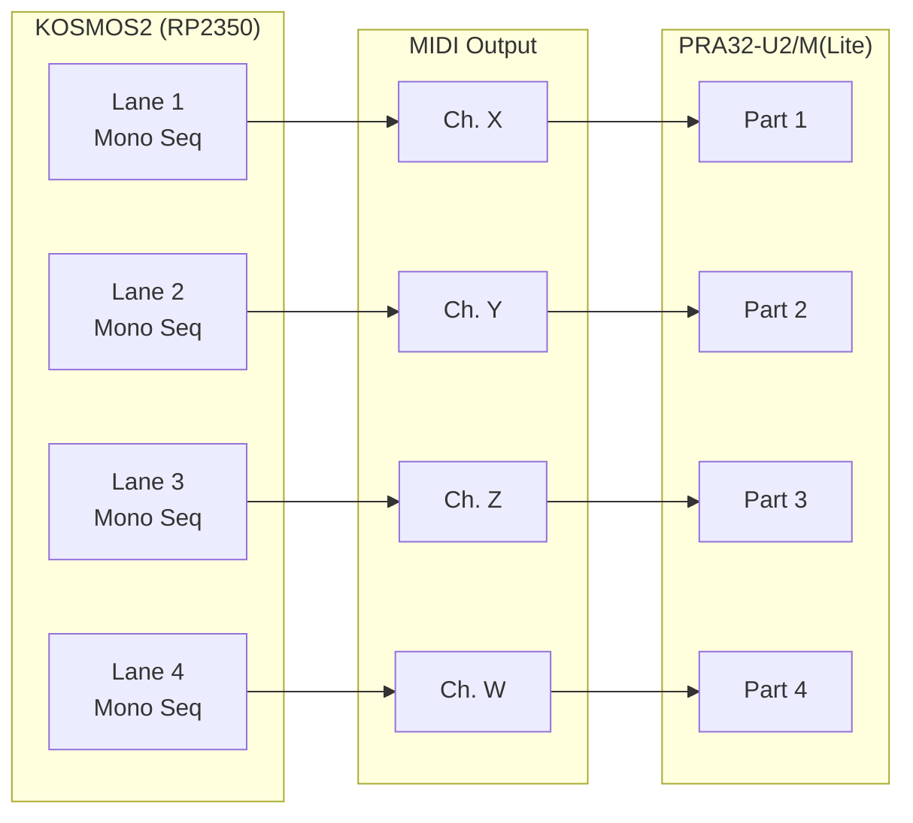
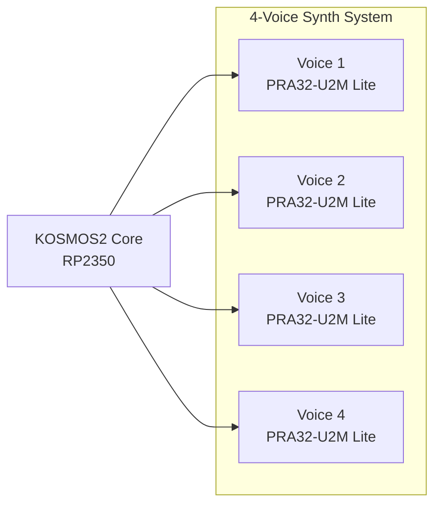
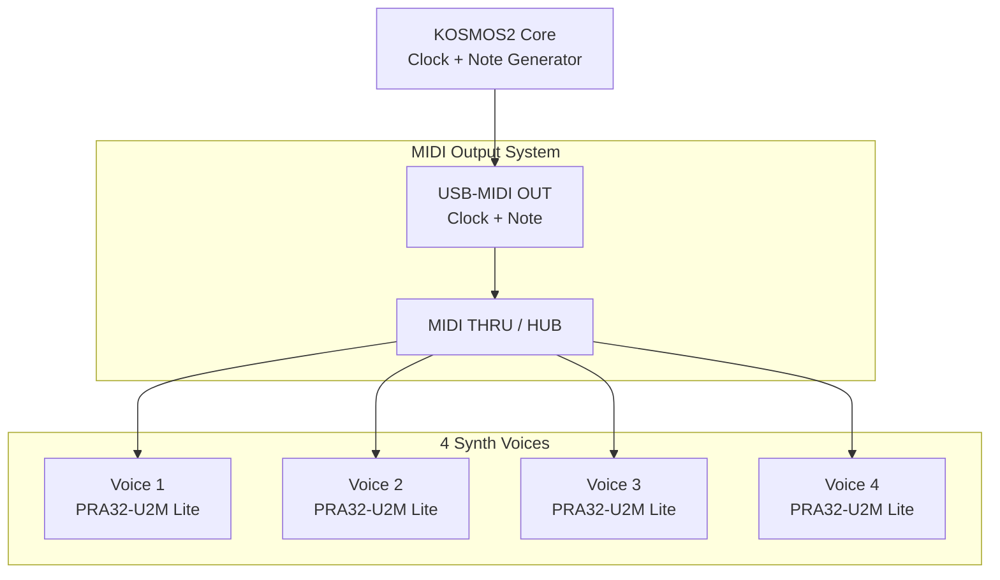
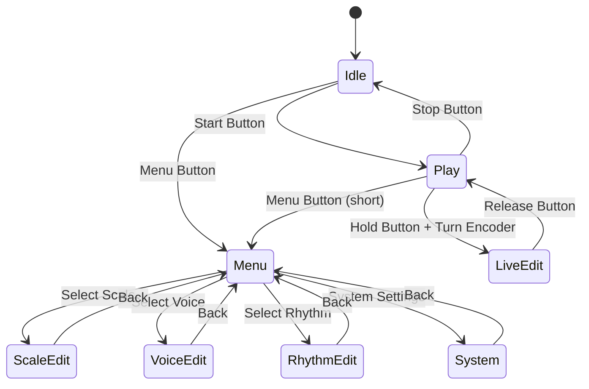
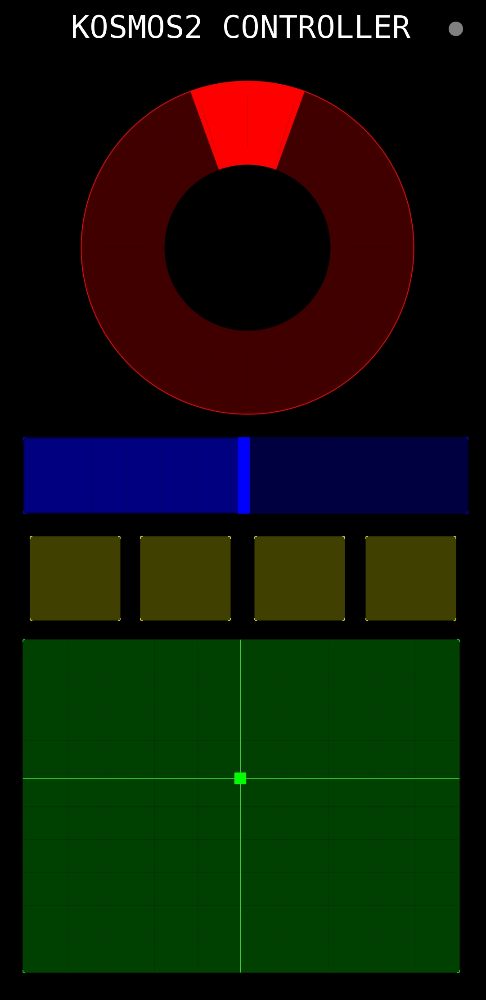

***
# KOSMOS2 4-voice Generative Instrument
*   **設計は4音ポリフォニック**
*   **4チャンネル・マルチティンバー**
*   **1パート＝1音モノフォニック**
*   **4レーン構成**
*   **チャンネル設定で「マルチティンバー／ポリフォニック」を切替可能**

という思想を、**構造・信号の流れ・実装上の注意**まで含めて詳細に説明し、
最後に **4レーンの概念図（Mermaid）** を示します。

***

## 1. 全体設計の基本思想

KOSMOS2 の PRA32-U2/M(Lite)対応における根幹思想は次の一点です。

> **内部構造は常に「4レーン × 各レーン1音モノフォニック」\
> ⇒ 同一MIDIチャンネルに束ねることで「4音ポリフォニック」に見せる**

つまり、

*   **内部は常にシンプルなモノフォニック×4**
*   **外部（MIDIチャンネル割当）によって意味が変わる**

という設計です。

***

## 2. 「4音ポリフォニック」かつ「4チャンネル・マルチティンバー」

### 2.1 内部ボイス構造

| 要素    | 内容                    |
| ----- | --------------------- |
| レーン数  | 4                     |
| 各レーン  | 完全モノフォニック（同時発音は必ず1音）  |
| ボイス管理 | レーン単位で完全独立            |
| シーケンス | 各レーンが独立したMIDIイベント列を保持 |

 **ポリフォニーは「レーン数」で担保**\
 **音色分離は「MIDIチャンネル」で担保**

***

### 2.2 4チャンネル・マルチティンバー動作

各レーンに **異なる MIDI チャンネル** を割り当てた場合：

| レーン    | MIDI Ch | 音源側の意味         |
| ------ | ------- | -------------- |
| Lane 1 | Ch.1    | Part 1（Bass）   |
| Lane 2 | Ch.2    | Part 2（Lead）   |
| Lane 3 | Ch.3    | Part 3（Pad）    |
| Lane 4 | Ch.4    | Part 4（Seq/FX） |

*   各レーンは **常に1音のみ**
*   PRA32-U2/M(Lite)側では **4パート同時発音**
*   完全な **4チャンネル・マルチティンバー音源** として振る舞う

 **DAW／ハード音源的に最もわかりやすい構成**

***

## 3. 「4音ポリフォニック化」の仕組み

### 3.1 同一チャンネル設定によるポリフォニー化

4レーンすべてを **同一 MIDI チャンネル** に設定すると：

| レーン    | MIDI Ch |
| ------ | ------- |
| Lane 1 | Ch.1    |
| Lane 2 | Ch.1    |
| Lane 3 | Ch.1    |
| Lane 4 | Ch.1    |

このとき：

*   各レーンは **別々の Note On/Off** を送出
*   音源（PRA32-U2/M(Lite)）は **同一パート内で4音を同時発音**
*   結果として **最大4音ポリフォニック**

 **重要ポイント**

*   KOSMOS2自身は「ポリボイス管理」をしない
*   **音源側のポリフォニー機能を素直に使う**
*   内部はあくまで *4本のモノフォニック・シーケンサ*

***

### 3.2 なぜこの方式が優れているか

| 観点      | 利点               |
| ------- | ---------------- |
| 実装      | ボイスアロケータ不要       |
| バグ耐性    | レーン単位で状態が明確      |
| 拡張性     | チャンネル設定だけで役割変更可能 |
| MIDI整合性 | 正統派なMIDI設計       |
| RP2350  | 処理負荷が極小          |

 **ハードウェア・シーケンサとして理想的**

***

## 4. 各パート1音モノフォニック設計の意味

### 4.1 モノフォニックであることの積極的価値

*   グライド / レガート制御が簡単
*   ノート衝突やハンギングが起きにくい
*   ステップシーケンサーとの相性が抜群
*   音楽的にも「役割が明確」

 KOSMOS2は **「鍵盤ではなくレーンで音楽を組む」思想**

***

## 5. 実装上の注意点（重要）

### 5.1 同一チャンネル時の Note Off 管理

*   **各レーンは自分が出した Note のみ Off する**
*   グローバルな Note Kill をしない
*   同一 Note Number を別レーンで使うことも許容

 レーンID × Note Number で管理するのが安全

***

### 5.2 CC / Program Change の扱い

| メッセージ          | 推奨方針              |
| -------------- | ----------------- |
| Program Change | Lane 1のみ or グローバル |
| CC (Filter等)   | 全レーン送信 or 指定レーン   |
| Pitch Bend     | レーン個別推奨           |

***

## 6. 4レーン構造の概念図

**KOSMOS2 → PRA32-U2/M(Lite)** の関係を示した概念図です。

##  ポリフォニック時

*   **X = Y = Z = W**
*   すべて同一パートに流入
*   ⇒ 最大4音ポリフォニー

## 4-voice アーキテクチャ図（KOSMOS2 → PRA32-U2M(Lite)）

## MIDI ルーティング図（Clock / Link / MIDI Out → 4台）

## Passage Engine v2 の内部構造図

```mermaid
flowchart LR
    A[Input Params<br>Scale / Mode / Root / Width / Depth / Jump / Smooth]

    B[Float Position Engine<br>pos += speed]
    C[Speed Modulator<br>scale-dependent speed / randomness]
    D[Width & Depth Shaper<br>rotating / wide / deep movement]
    E[Jump Controller<br>probabilistic jump / trill]
    F[Note Selector<br>scale quantize + octave model]
    G[Duration & Velocity Model]

    A --> B
    B --> C
    C --> D
    D --> E
    E --> F
    F --> G

    G --> O[Output Note Event<br>pitch / velocity / duration]
```

## IO / LCD の状態遷移図

## 7. まとめ（設計哲学）

*   **内部は常に「4モノフォニック」**
*   **チャンネル設定で意味が変わる**
*   **4chマルチティンバー ⇔ 4音ポリフォニー**
*   ボイス管理を音源側に完全委譲
*   シンプルで強靭、RP2350向き

## 8. KOSMOS2 CONTROLLER

KOSMOS2 は外部 MIDI コントローラー（TouchOSC）からの操作に対応しています。  
演奏者はリアルタイムに「密度」「音程」「速度」「スケール」「音量」を操作し、  
KOSMOS2 の 4 パート（メロディ / ベース / コード / シーケンス）に生命感を与えることができます。

### コントローラー構成（TouchOSC）

KOSMOS2 Controller は以下の 5 つの操作子で構成されています。

| UI Element | MIDI CC | Range | Function |
|-----------|---------|--------|----------|
| XYPad (X) | CC20 | 0–127 | **Density（音の密度）**：メロディとシーケンスの発音頻度を制御 |
| XYPad (Y) | CC21 | 0–127 | **Pitch（音程オフセット）**：メロディの中心音を ±24 半音で変化 |
| Encoder | CC22 | -63〜+63 | **Speed（速度）**：内部テンポ倍率を相対値で変更 |
| Scale Buttons | CC23 | 0〜3 | **スケール切替**：0=HEI, 1=MIYA, 2=INSEN, 3=PENTA |
| Volume Fader | CC7 | 0–127 | **Master Volume**：全パートの出力音量 |

---

### 各コントロールの動作詳細

#### ● Density（CC20）
- メロディとシーケンスの発音確率を制御  
- 0 で最小、127 で最大  
- Passage Engine の「呼吸の速さ」に影響

#### ● Pitch（CC21）
- メロディの中心音を ±24 半音で変化  
- スケールは維持されるため破綻しない  
- ベース・コード・シーケンスは自動追従

#### ● Speed（CC22）
- 相対値（-63〜+63）で内部テンポを変化  
- Passage Engine の進行速度に影響  
- シーケンスの細かさも変化する

#### ● Scale（CC23）
- KOSMOS2 全パートのスケールを即時切替  
- HEI / MIYA / INSEN / PENTA の 4 種類  
- メロディ・ベース・コード・シーケンスが同時に変化

#### ● Volume（CC7）
- 全パートのマスター音量  
- PRA32-U2M(Lite) の 2VCO 構成と組み合わせて厚みを調整可能

---

### コントローラーの目的

KOSMOS2 Controller は、  
**「自律生成される 4 パートの音楽を、演奏者が“手で導く”ためのインターフェイス」**  
として設計されています。

- メロディ：Passage Engine による自律生成  
- ベース：低音の安定パターン  
- コード：1ボイス＋音源側 2VCO による和音の気配  
- シーケンス：高速アルペジオ

これらを TouchOSC でリアルタイムに操作することで、  
KOSMOS2 は“多声の生命体”として振る舞います。

## KOSMOS2 CONTROLLER

## Special Thanks
- MATRIXSYNTH
- Powerd by ISGK Instruments PRA32-U2
- https://github.com/risgk/digital-synth-pra32-u2

***
