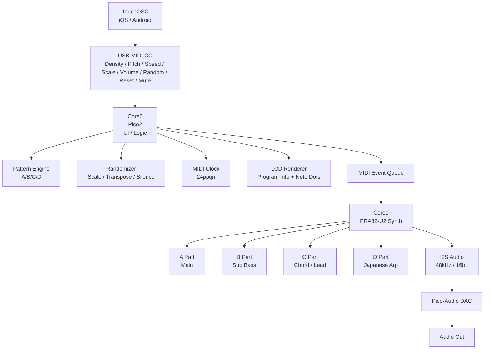
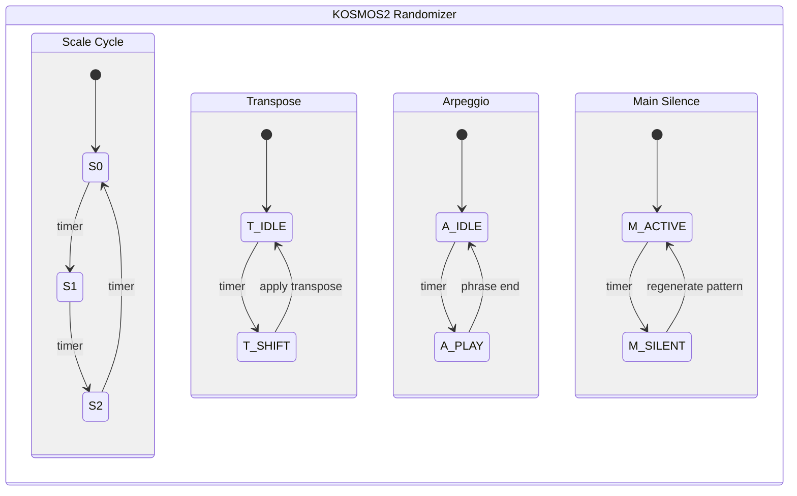
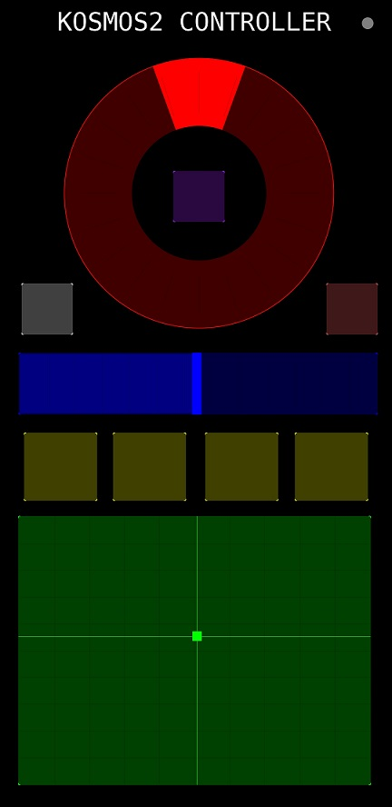

# 🎛️ **KOSMOS2**  
### *ジェネレーティブ音響エンジン & パフォーマンスコントローラー*  

---

## 🚀 概要

**KOSMOS2** は、Raspberry Pi Pico2 と PRA32-U2 を中心に構築された  
**4パート構成のジェネレーティブ音響エンジン**です。

- 4つの独立したシンセパート（A/B/C/D）  
- TouchOSC によるリアルタイム操作  
- MIDI Clock（24ppqn）を安定出力  
- 自動スケール・自動トランスポーズ・自動アルペジオ  
- ランダムパターン生成  
- **1パートだけミュートランダム**  
- **音程に応じたカラーのノート可視化**  
- 物理ボタンによる音色変更・スタート/ストップ  

KOSMOS2 は、  
**“自律生成” と “手動操作” を自然に融合させたライブ楽器**です。

---

## 🧩 システム構成図



---

## 🎚️ TouchOSC コントロール（MIDI CC）

| CC | パラメータ | 説明 |
|----|------------|------|
| **20** | Density | 発音率（0〜100%） |
| **21** | Pitch Offset | -24〜+24 半音 |
| **22** | Speed | テンポ倍率（0.5〜2.0） |
| **23** | Scale | 0=平調子 / 1=都節 / 2=陰旋法 |
| **7**  | Volume | マスター音量 |
| **30** | ガチャ | 4パートの音色をランダム変更（ミュート含む） |
| **31** | リセット | 音色初期化 + **全ミュート解除** |
| **32** | ミュートランダム | **1パートだけ**ミュート/解除をランダム切替 |

---

## 🔇 パート別ミュート仕様

- `muteA / muteB / muteC / muteD` で発音を制御  
- ガチャ（CC30）で programX==16 の場合もミュート扱い  
- リセット（CC31）で **全パートのミュート解除**  
- ミュートランダム（CC32）は **1パートのみ**をトグル  
- LCD 表示はミュート中 `--`、通常は音色番号

---

## 🖥️ LCD UI

### ● Program Info（音色 & ミュート表示）

```
A:03   B:--   C:06   D:12
```

- ミュート中 → `--`
- 通常 → 音色番号（00〜15）

### ● Note Dots（ノート可視化）

```
───────────────────────────────────────────────
・240px 横スクロールのノート履歴
・Y座標 = 音程（36〜84 → 240〜150 にマッピング）
・音程に応じて色分け
───────────────────────────────────────────────
```

A/B/C/D すべてのノートをリアルタイムに描画。

---

## 🎼 4パート構成（PRA32-U2）

| パート | 役割 | 説明 |
|--------|------|------|
| **A** | Main | 8分 × 16 のメインパターン |
| **B** | Sub Bass | 長いサスティンの低音、3種のリズム |
| **C** | Chord / Lead | 和声的動き、遅れ気味のタイミング |
| **D** | Japanese Arp | 和風16分アルペジオ、小さな揺れ |

---

## 🔀 ランダマイザ



### ● 自動スケール切替  
0 → 1 → 2 を一定周期で循環。

### ● 自動トランスポーズ  
`{-10, -5, -4, 0, +4, +5, +10}` からランダム選択。

### ● 自動アルペジオ  
一定間隔で D パートにアルペジオを挿入。

### ● メインサイレンス  
A パートを一時的に沈黙させ、再開時にパターン再生成。

---

## 🎛 物理ボタン（Pico2）

| ボタン | 機能 |
|--------|------|
| **A** | A パート音色変更 |
| **B** | B パート音色変更 |
| **X** | 4パート音色ガチャ（CC30） |
| **Y** | 4パート音色リセット（CC31） |
| **A+B** | MIDI Start / Stop |

※ **ジョイスティックは使用していません**

---

## 📦 ハードウェア構成

- Raspberry Pi **Pico2**  
- Waveshare Pico-Audio  
- Waveshare Pico-LCD 1.3"  
- PRA32-U2 Synth Engine（Core1）  
- TouchOSC（iOS/Android）

## KOSMOS2 CONTROLLER



---

## 📝 ライセンス

MIT License

---

## Special Thanks
- MATRIXSYNTH
- Powerd by ISGK Instruments PRA32-U2
- https://github.com/risgk/digital-synth-pra32-u2

***
